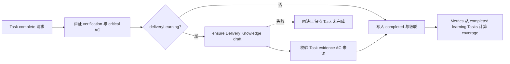

# Metrics Correctness and Automatic Delivery Learning - 技术设计

## 方案概述

本设计覆盖 L1 的 AC-1、AC-2、AC-3 与 AC-9，分为两个相互约束的能力：治理指标集合闭合，以及 learning-enabled Task 完成时自动产生 Delivery Knowledge draft。

指标侧先为每一类指标建立显式 eligible source set，再从同一个集合投影互斥状态、分子、分母与分组。Spec validity 的未标注来源必须进入 `unknown`；Delivery Knowledge coverage 以启用 learning 且已完成的 Task 为分母，以这些 Task 中具有当前知识记录的 Task 为分子，禁止用全量知识记录数量对比空的 L3 声明集合。

交付学习侧把 draft 生成纳入 Task completion 的同一文件事务。完成流程先验证 verification、critical AC evidence 与 learning policy，再根据 Task、成功 evidence 和 AC coverage 确保存在一个 draft。只有该步骤成功，才能写入 Task completed 状态并执行规格链级联。自动草稿仍遵循现有人工 approve 与来源复验规则，draft 不进入 Brief 或 Lessons。

## 技术决策

### 决策 1：每个指标从单一 eligible 集合同时计算分子与分母

- `buildKnowledgeMetrics` 必须先构造按来源类型分组的 eligible 集合，再计算 `current`、`historical`、`superseded`、`invalidated`、`unknown`。
- 未显式声明且无法从受支持事实派生状态的来源归入 `unknown`，不能从分母中消失。
- 任一 coverage 返回前必须满足 `0 <= numerator <= denominator`；分母为 0 时返回 `0/0` 且 ratio 为 `null`。
- 输出保留 project/topic 过滤与 legacy 可读性，并补充集合口径字段，避免调用方猜测分母。

### 决策 2：Delivery coverage 以 Task 为统计单位

- eligible denominator 是 `deliveryLearning: true` 且状态为 `completed` 的 Task。
- numerator 是 eligible Task 中存在一个当前 Delivery Knowledge 记录的 Task 数量，而不是知识记录总数。
- draft、approved、rejected 分布独立报告；同一 Task 的历史版本不得重复抬高 coverage numerator。
- 旧 L3 未声明 delivery learning 时保持非 eligible，不追溯修改。

### 决策 3：Task completion 使用 ensure-draft 语义

- 在 `runTaskCompletionUnlocked` 中，所有 verification 与 critical AC evidence 验证成功后，调用 `ensureDeliveryKnowledgeDraft`。
- `deliveryLearning` 为 `false` 或缺省时不生成记录；为 `true` 时，如果已存在关联记录则复用并验证其来源，如果不存在则确定性生成 draft。
- 自动 draft 的来源至少包含 Task、成功 verification evidence 与已覆盖 critical AC；摘要与结论只基于这些结构化事实，不从自由文本推断新的强结论。
- draft 创建失败必须中止完成流程，Task 状态、完成时间和规格链状态均不得改变。

### 决策 4：自动提炼与人工发布严格分离

- 自动生成记录固定为 `draft`，不得调用 approve、不得写入召回索引的 approved 集合。
- Brief 与 Lessons 继续只读取 approved Delivery Knowledge。
- approve 时继续执行现有 source revalidation；来源被删除、失败或失配时拒绝批准。
- 人工预先声明的 draft 优先于自动生成，避免覆盖人工结论；approved/rejected 历史记录保持不可变。

### 决策 5：兼容历史数据并提供可审计错误

- 新增字段在读取旧快照时必须有明确默认值，不迁移既有 Task、L3 或知识记录。
- 指标输出可增加字段但不得改变现有命令的退出码和默认人类可读入口。
- completion 错误必须指出 Task、learning policy 与缺失/无效来源，便于重试且不留下半完成状态。

## 数据流



## 受影响模块

| 模块 | 变更 | 责任边界 |
|---|---|---|
| `src/core/knowledge-metrics.ts` | 重建 eligible 集合、validity unknown 与 delivery coverage | 只读投影，不修改事实文件 |
| `src/core/task-completion.ts` | 在完成事务内接入 ensure-draft | 负责顺序、失败原子性和级联边界 |
| `src/core/delivery-knowledge.ts` | 提供确定性 ensure/create draft 与来源校验 | 不自动 approve，不参与召回 |
| `src/core/task-evidence.ts` | 暴露成功 verification 与 critical AC 的规范化来源 | 不放宽 evidence 成功判定 |
| `src/core/project-snapshot.ts` | 为指标提供 Task/L3/knowledge 关联快照 | 保持 legacy 字段可选 |
| `src/cli/commands/project.ts` | 呈现集合口径和有效 coverage | 不引入写操作 |
| `tests/knowledge-metrics.test.ts` | 覆盖集合恒等式、0 分母与重复记录 | 包含 topic/project 与 legacy fixture |
| `tests/task-completion.test.ts`、`tests/delivery-knowledge.test.ts` | 覆盖自动 draft、复用、回滚、审批隔离 | 验证 Task 与知识文件原子结果 |

## 接口契约

### Metrics 集合与 coverage

```ts
interface MetricSourceSet {
  eligible: number;
  current: number;
  historical: number;
  superseded: number;
  invalidated: number;
  unknown: number;
}

interface CoverageMetric {
  numerator: number;
  denominator: number;
  ratio: number | null;
  unit: "task" | "spec" | "decision" | "source";
  eligibility: string;
}
```

契约不变量：`eligible === current + historical + superseded + invalidated + unknown`；`numerator <= denominator`；`denominator === 0` 时 `numerator === 0 && ratio === null`。

### Delivery Knowledge ensure

```ts
interface EnsureDeliveryKnowledgeDraftInput {
  taskId: string;
  l3Code: string;
  verificationIds: string[];
  criticalAcIds: string[];
}

interface EnsureDeliveryKnowledgeDraftResult {
  action: "created" | "reused" | "skipped";
  knowledgeId?: string;
  status?: "draft";
  sourceRefs: string[];
}
```

- 输入中的 verification 必须属于该 Task 且成功；AC 必须属于关联 L3 的 critical AC。
- `created` 与 `reused` 都必须返回可复验来源；`skipped` 仅允许 delivery learning 未启用。
- 函数不得产生 approved 记录，也不得改变 Task 状态。

### Task completion 顺序

1. 读取并锁定 Task 与关联 L3。
2. 验证 Profile、verification 与 critical AC coverage。
3. 根据 learning policy 执行 ensure-draft。
4. 重新校验待写 facts，并原子写入知识记录与 Task completed 状态。
5. 执行规格链级联与审计记录。

任何步骤失败时，步骤 4 与 5 均不得留下部分写入。

## 异常与边界

| 场景 | 预期行为 |
|---|---|
| 未标注 validity 的 legacy Spec | 进入 unknown 与 eligible，不报错、不写 annotation |
| 无 eligible delivery Task | coverage 为 0/0/null |
| 同一 Task 有多个历史知识记录 | coverage numerator 只计 1；状态分布按当前记录计算 |
| learning-enabled Task 没有成功 evidence | completion 失败，不创建 draft、不完成 Task |
| 已有人工 draft | 复用并复验来源，不覆盖内容 |
| 已有 approved 记录 | 复用关联事实，不创建重复 draft |
| draft 创建后后续 Task 写入失败 | 整个事务回滚 |
| draft 未批准 | 不出现在 Brief、Lessons 或 approved coverage 中 |

## 验证策略

- 使用属性测试生成不同状态组合，验证集合恒等式和 coverage 不变量。
- 使用 legacy fixture 验证缺省字段不会导致读取、指标或 completion 回归。
- 使用文件快照测试验证 completion 失败前后 Task、Delivery Knowledge、关联 Spec 均无变化。
- 使用集成测试完成一个 governed learning Task，断言 draft 自动创建、来源齐全、召回隔离，随后 approve 复验成功才进入 Lessons。
- 运行 lint、build 与完整测试套件，确保现有 CLI 输出和审批流程兼容。

## L3 裂变计划

| L3 | 标题 | 覆盖范围 | 关键验收 |
|---|---|---|---|
| `spec-knowledge-operational-closure-L3.1.1` | Metrics Set Semantics | eligible source set、validity unknown、Task-based delivery coverage、CLI 投影 | AC-1、AC-9 |
| `spec-knowledge-operational-closure-L3.1.2` | Automatic Delivery Learning Draft | completion 事务、ensure-draft、来源复验与召回隔离 | AC-2、AC-3、AC-9 |

L2 审批后将 scope 固定为上述两个 L3；在此之前不创建 L3。

## 风险与权衡

| 风险 | 权衡与缓解 |
|---|---|
| 全量 unknown 使治理数字短期变差 | 真实暴露治理债务，同时提供类型/topic 分组而非隐藏分母 |
| 自动摘要信息不足 | 只生成可审核 draft，限定结构化事实，允许人工补充或 reject |
| completion 事务扩大 | 复用现有文件事务与锁，增加失败注入测试 |
| 重复知识记录影响 coverage | 以 Task 去重并定义当前记录选择规则 |

## 关联

- based_on: `spec-knowledge-operational-closure-L1`
- references: `spec-knowledge-activation-hardening-L2.2`
- references: `spec-knowledge-governance-L2.2`
- references: `adaptive-profile-intelligence-L2.1`
