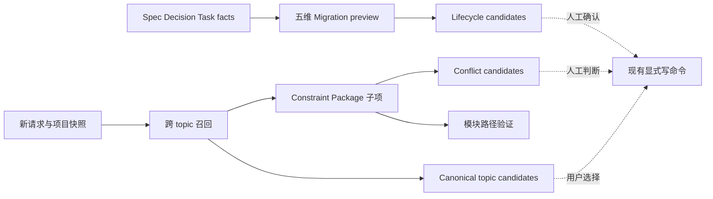

# Knowledge Lifecycle, Constraint Trust, and Migration Guidance - 技术设计

## 方案概述

本设计覆盖 L1 的 AC-4、AC-5、AC-6、AC-7、AC-8 与 AC-9，把现有召回与治理能力提升为可解释、可复验但不自动处置的知识激活层。

设计包含四条管线：治理预览生成 Spec/Decision/关系/history/critical AC 候选；Constraint Package 为 AC、Lesson、模块和冲突项逐项附加来源、置信度与知识状态；模块解析验证路径并区分 current、historical、unknown；工作流入口按召回分数与历史强度推荐 canonical topic。所有管线只产生候选，不改变 Spec validity、Decision status、relations、historyReview、AC 或 topic。

## 技术决策

### 决策 1：用统一 candidate envelope 表达治理建议

- validity、Decision lifecycle、supersedes relation、history disposition 与 critical AC readiness 候选共享 `candidateType`、`sourceRefs`、`reasonCodes`、`confidence`、`knowledgeState` 与 `suggestedAction`；需求来源为 `spec-knowledge-operational-closure-L1`。
- candidate 必须携带足够事实让人工定位来源；缺少证据时输出 `unknown` 或不生成，不能伪装成确定结论。
- preview 只读扫描仓库事实，前后文件哈希必须一致。
- 任何状态、关系或 history disposition 的写入继续使用现有显式命令与审批流程。

### 决策 2：冲突候选组合结构化 disposition 与受控词法信号

- 高优先信号来自 current Decision、关键 AC、historyReview 中 `reuse/change/reject` disposition 及明确 RFC 2119 约束。
- 对新请求与历史约束进行规范化术语、否定词、动作和对象比较，记录命中的双方片段与 reason code。
- 结构化 `reject` 或互斥动作可提高置信度；仅共享关键词不得直接判定 conflict。
- 证据不足时返回 `unknown` candidate，绝不自动阻断工作流或修改 disposition。

### 决策 3：Constraint Package 子项独立可追溯

- AC、Lesson、module、conflict 每一项都必须携带 canonical `sourceRefs`、`confidence` 和 `knowledgeState`，不得只继承包级置信度。
- sourceRef 使用现有 `spec:`、`decision:`、`task:`、`evidence:`、`delivery-knowledge:` 等命名空间。
- 顶层摘要由子项聚合，但不能覆盖或隐藏低置信与 unknown 状态。
- 旧调用方可继续读取已有字段；新增信任元数据采用向后兼容扩展。

### 决策 4：模块引用先结构化提取再验证路径

- 优先从 frontmatter、relations、验证记录和明确代码块提取模块；正文正则只作为低置信后备来源。
- 对仓库当前存在且位于允许代码根的路径标记 `current-path`。
- 来源明确但当前不存在的历史路径标记 `historical-path`；无法确认为路径的文本标记 `unknown-path`，不得作为真实模块展示。
- 路径状态、检测依据、sourceRef 与 confidence 必须随模块项输出。

### 决策 5：canonical topic 推荐是排序候选而不是隐式重命名

- 聚合召回结果中的 topic，综合相关性、current 知识比例、Decision/关键 AC 强度、历史使用量与精确匹配信号排序。
- 输出前若干 canonical topic、分数分解与理由，同时保留显式 `create-new-topic` 选择。
- 低置信或候选接近时不自动选中；不得创建、合并或重命名 topic。
- 工作流不同入口必须复用同一推荐器，避免 `next`、Brief 与 spec 创建提示不一致。

### 决策 6：迁移预览覆盖五类治理维度并可模拟指标变化

- 必须覆盖 Spec validity、Decision lifecycle、替代关系、history disposition、critical AC readiness 五类批次。
- 每批提供候选数、优先级、理由、来源和建议人工命令，但默认不执行。
- 可选 simulated metrics delta 只基于候选假设计算并明确标记 simulation，不能写回 metrics 或 facts。
- preview 支持 project/topic 范围，输出确定性排序和 JSON/human 双视图。

## 数据流



## 受影响模块

| 模块 | 变更 | 责任边界 |
|---|---|---|
| `src/core/knowledge-migration.ts` | 五维批次、统一 candidate envelope、模拟 delta | 只读，不执行建议动作 |
| `src/core/knowledge-activation.ts` | 结构化模块提取与路径验证 | 不把普通文本升级为真实路径 |
| `src/core/capability-types.ts` | 子项 trust metadata、path state、conflict/topic candidate 类型 | 保持已有字段兼容 |
| `src/core/capability-brief.ts` | 逐项来源/置信度/状态、冲突候选与 topic 聚合 | approved-only Lesson 边界不变 |
| `src/core/workflow-surface.ts` | 统一呈现 canonical topic 候选和 create-new 选择 | 不自动创建或切换 topic |
| `src/core/critical-readiness.ts` | 提供只读 readiness 候选事实 | 不自动插入 critical AC |
| `src/core/knowledge.ts`、Decision 读取模块 | 提供 validity/lifecycle/relations 规范化事实 | 不新增隐式状态写入 |
| `src/cli/commands/project.ts`、Brief presenter | JSON/human 输出新增候选与证据 | 保持既有命令入口 |
| `tests/knowledge-migration.test.ts`、`tests/capability-brief.test.ts`、`tests/workflow-surface.test.ts` | 只读性、冲突解释、路径三态、topic 排序 | 覆盖 legacy 与确定性输出 |

## 接口契约

### 统一治理候选

```ts
type GovernanceCandidateType =
  | "spec-validity"
  | "decision-lifecycle"
  | "supersedes-relation" // spec-knowledge-operational-closure-L1
  | "history-disposition"
  | "critical-ac-readiness";

interface GovernanceCandidate {
  candidateType: GovernanceCandidateType;
  subjectRef: string;
  sourceRefs: string[];
  reasonCodes: string[];
  confidence: number;
  knowledgeState: "current" | "historical" | "superseded" | "invalidated" | "unknown";
  suggestedAction: string;
}
```

`confidence` 范围为 0..1；候选必须至少有一个 canonical sourceRef 和一个稳定 reason code；它不是状态事实。

### 约束子项

```ts
interface ConstraintTrust {
  sourceRefs: string[];
  confidence: number;
  knowledgeState: "current" | "historical" | "superseded" | "invalidated" | "unknown";
}

interface ModuleConstraint extends ConstraintTrust {
  path: string;
  pathState: "current-path" | "historical-path" | "unknown-path";
  detection: "structured" | "code-block" | "text-fallback";
}

interface ConflictCandidate extends ConstraintTrust {
  requestEvidence: string;
  historicalEvidenceRef: string;
  reasonCodes: string[];
  verdict: "candidate" | "unknown";
}
```

每类 AC、Lesson、module、conflict 输出都实现 `ConstraintTrust`；无来源项不得进入约束包。

### Canonical topic 推荐

```ts
interface CanonicalTopicCandidate {
  topic: string;
  confidence: number;
  relatedSpecCount: number;
  currentKnowledgeCount: number;
  criticalConstraintCount: number;
  reasons: string[];
}

interface TopicRecommendation {
  candidates: CanonicalTopicCandidate[];
  selection: "candidate" | "ambiguous" | "create-new";
  createNewAllowed: true;
}
```

相同快照与请求必须产生稳定排序；并列使用 topic 字典序作为最终 tie-breaker。

### Migration preview

```ts
interface KnowledgeMigrationPreview {
  scope: { topic?: string };
  batches: Record<GovernanceCandidateType, GovernanceCandidate[]>;
  simulatedMetricsDelta?: Record<string, number>;
  readOnly: true;
}
```

preview 执行前后，Spec、Decision、Task、Delivery Knowledge、config 与 audit facts 必须保持不变。

## 异常与边界

| 场景 | 预期行为 |
|---|---|
| 仅有关键词重叠 | 不产生确定 conflict；最多输出低置信 unknown |
| Decision active 但证据陈旧 | 输出 lifecycle candidate，不自动 supersede |
| 文本类似 `foo/bar` 但仓库无路径证据 | 标记 unknown-path，不计入 current module |
| 明确历史 Spec 引用已删除路径 | 标记 historical-path 并保留来源 |
| 多个 topic 分数接近 | selection 为 ambiguous，展示候选与 create-new |
| 无高置信 topic | 明确保留 create-new，不从英文 token 强制推断 |
| legacy 子项没有新元数据 | 读取时规范化为 unknown/低置信，命令不失败 |
| preview 某维无候选 | 返回空批次而不是省略维度 |
| simulated delta 无法可靠计算 | 省略模拟字段并说明原因，不影响基础 preview |

## 验证策略

- 使用 golden fixtures 覆盖五类 migration batch、稳定排序、reason code 与全程只读哈希。
- 构造 reuse/change/reject、Decision、关键 AC 与否定词组合，验证 candidate、unknown 和无冲突三类结果。
- 使用真实存在、历史删除和伪路径样本验证模块三态及 structured 优先级。
- 对每种 Constraint Package 子项执行 schema 测试，确保 sourceRefs、confidence、knowledgeState 完整。
- 使用跨 topic 请求验证 canonical topic 排序、理由、ambiguous 与 create-new 分支。
- 运行 legacy fixture、lint、build 与完整测试套件，验证纯本地和 CLI 兼容。

## L3 裂变计划

| L3 | 标题 | 覆盖范围 | 关键验收 |
|---|---|---|---|
| `spec-knowledge-operational-closure-L3.2.1` | Lifecycle Candidates and Constraint Trust | 生命周期/冲突候选、子项 trust metadata、模块路径三态 | AC-4、AC-5、AC-6、AC-9 |
| `spec-knowledge-operational-closure-L3.2.2` | Migration Dimensions and Canonical Topic | 五维迁移预览、模拟 delta、canonical topic 推荐 | AC-7、AC-8、AC-9 |

L2 审批后将 scope 固定为上述两个 L3；在此之前不创建 L3。

## 风险与权衡

| 风险 | 权衡与缓解 |
|---|---|
| 词法冲突误报增加审核噪声 | 分离 candidate/unknown，公开 reason code 与双方证据，不作为 gate |
| 当前路径判断受工作树影响 | 记录检测时点和来源，历史路径保持独立状态 |
| 五维 preview 候选过多 | 按风险、置信度与 topic 分批，保持确定性上限和摘要 |
| topic 推荐强化旧 topic 偏差 | 同时计算相关性与知识强度，保留 ambiguous/create-new 人工选择 |
| 新字段扩大输出体积 | 默认 human view 摘要，JSON 保留完整证据链 |

## 关联

- based_on: `spec-knowledge-operational-closure-L1`
- references: `spec-knowledge-activation-hardening-L2.1`
- references: `spec-knowledge-activation-hardening-L2.2`
- references: `critical-ac-readiness-L2.1`
